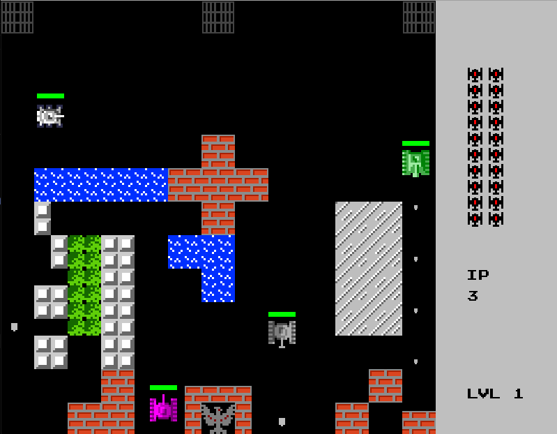
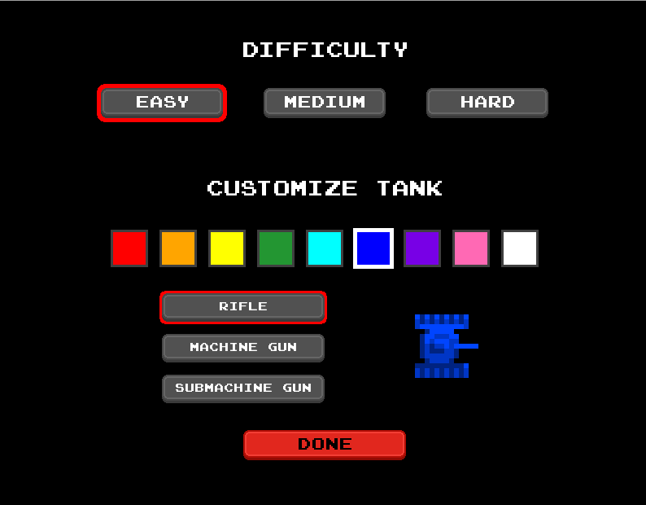
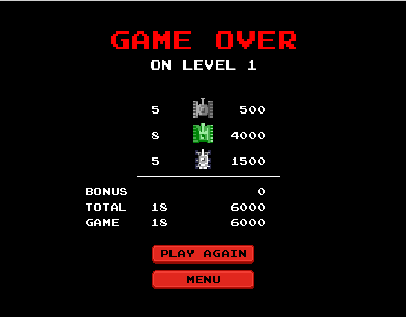

# Battle City

### Created by Andy Li

A game inspired by the original Battle City (1985 Namco), with some modern variations. 
Written entirely in Java with LibGDX. All images are drawn by the author.

Although development has been concluded for now, bugs may still be present. If there are any, please email the author at andyliqy@gmail.com.

### Demo

https://user-images.githubusercontent.com/54689920/197891898-338627fa-2484-4c4e-a778-47459180d5d0.mp4

### How to play
Defend your flag. Shoot enemy tanks.

Each level has 20 enemy tanks. You only have four lives, so don't let them shoot you! 
Don't let them shoot your flag either: if that's hit, the game is over.

### Controls
Player 1: WASD to move, B to shoot 
Player 2: Arrow keys to move, M to shoot

### Features
-Singleplayer and two players 
-Three difficulties: easy, medium, hard 
-Customizable guns and player colors 
-Levels can be added with a simple .txt file 
-Medium and hard difficulty uses BFS to find the shortest route to your flag, easy uses a randomly generated path

### To Run
Requires Java 1.8  
1. Clone the repo.  
2. In the top directory, type:  
`./gradlew build` and `./gradlew run` (MacOS/Linux) 
`gradlew build` and `gradlew run` (Windows)

### Images

